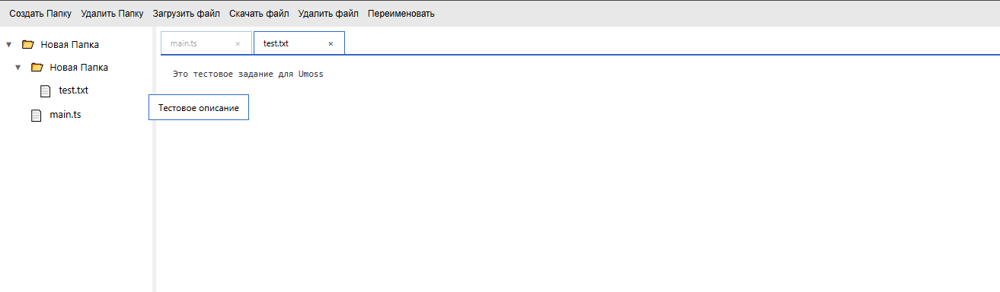

# Umoss Test

Веб-приложение для управления файлами и папками с возможностью редактирования содержимого.
Проект построен на TypeScript + Vite с модульной архитектурой.



## Запуск проекта

```bash
# Установка зависимостей
npm install

# Запуск в режиме разработки
npm run dev

# Сборка для продакшена
npm run build

# Предпросмотр собранной версии
npm run preview
```

После запуска `npm run dev` приложение будет доступно по адресу http://localhost:5173
